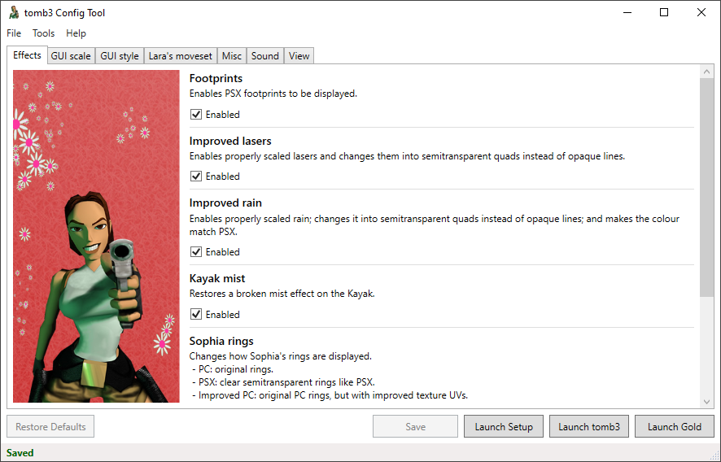

# tomb3 Configuration Tool
_A GUI tool for modifying the settings for [tomb3](https://github.com/Trxyebeep/tomb3)._

## Prerequisites
* [.NET Core 6.0](https://dotnet.microsoft.com/en-us/download/dotnet/6.0)

## Usage
1. Download the latest release from https://github.com/lahm86/tomb3_ConfigTool/releases/latest.
2. Place the tomb3_ConfigTool.exe file in the same directory as your tomb3 installation.
3. Launch tomb3_ConfigTool.exe.
4. Change as many settings as desired. Press `Save` to write these values to disk so that tomb3 can read them.
5. Shortcut buttons are provided to launch the game:
   * Use the `Launch Setup` button to open the original setup window.
   * Use the `Launch tomb3` button to start the normal game.
   * Use the `Launch Gold` button to start the gold edition of the game (The Lost Artefact).
6. Use the `Restore Defaults` button at any time to revert to the default settings.

Settings can also be exported and imported via the `Tools` menu options.

## Thanks
Thank you to:

* Trxyebeep, for guidance on requirements, and testing.
* rr-, for permission to use the [Tomb1Main](https://github.com/rr-/Tomb1Main) configuration tool as a basis for this project.
* Tomb of Ash, for making available the [Tomb Raider Classic Style Guide](https://www.tomb-of-ash.com/tomb-raider-classic-style-guides/); all graphics in this application come from this resource.
* Ste from [tombraiderfrance.com](https://www.tombraiderfrance.com/), for providing French localisation.
